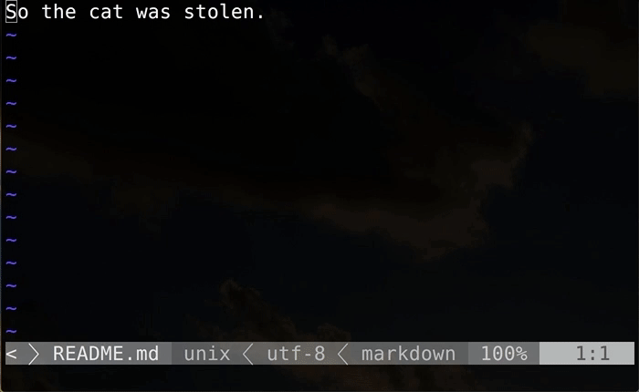

# vim-textlint

[](https://travis-ci.org/heavenshell/vim-textlint)

Wrapper for [textlint](https://textlint.github.io/).



## Motivations

I want to load `textlint` config file dynamically.

[Syntastic](https://github.com/scrooloose/syntastic) can use `textlint` but not support config file.

[watchdocs.vim](https://github.com/osyo-manga/vim-watchdogs) also has `textlint` settings but not supporting config file.


## Configure

Add `textlint` config file name to your `.vimrc`.
```viml
" textlint.vim {{{
let g:textlint_configs = [
  \ '@azu/textlint-config-readme',
  \ '@example/textlint-config-example',
  \ ]
" }}}
```

## Usage

```viml
:Textlint
:cwindow
```
If you did not set any args, `vim-textlint` would use `g:textlint_configs`'s first value or `textlintrc`.

```viml
:Textlint -c @example/textlint-config-example
:cwindow
```
You can select `textlint` config file via command line.

## Autofix

If rules are fixable, you can autofix with `TextintFix`.

## Helpful plugins

[QuickFixstatus](https://github.com/dannyob/quickfixstatus) shows error message at the bottom of the screen.

[Hier](https://github.com/cohama/vim-hier) will highlight `quickfix` errors and location list entries in buffer.

## Sample settings

After run `:Textlint` textlint.vim would show errors if error exists.

- Show QuickFix error in statusline, and highlight QuickFix errors run
  quickfixstatus.vim and vim-hier.

```viml
  function! s:textlint_after(...)
    execute ':QuickfixStatusEnable'
    execute ':HierUpdate'
  endfunction

  let g:textlint_callbacks = {
    \ 'after_run': function('s:textlint_after')
    \ }
  autocmd BufWritePost *.md call textlint#run()
  autocmd InsertLeave *.md call textlint#run()
  " TextChanged triggered very often, turn off if Vim is slow.
  autocmd TextChanged,TextChangedI *.md call textlint#run()
```
